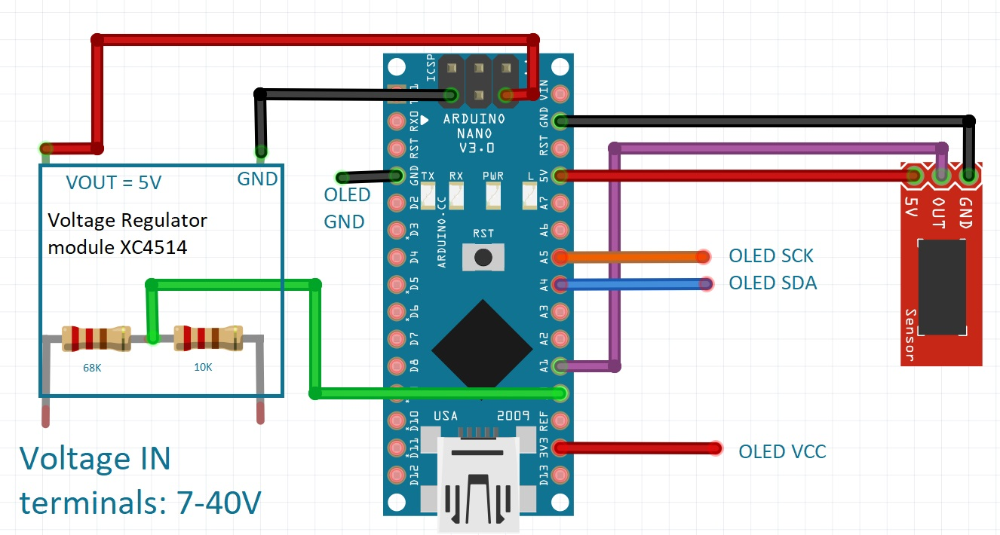
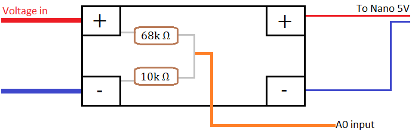
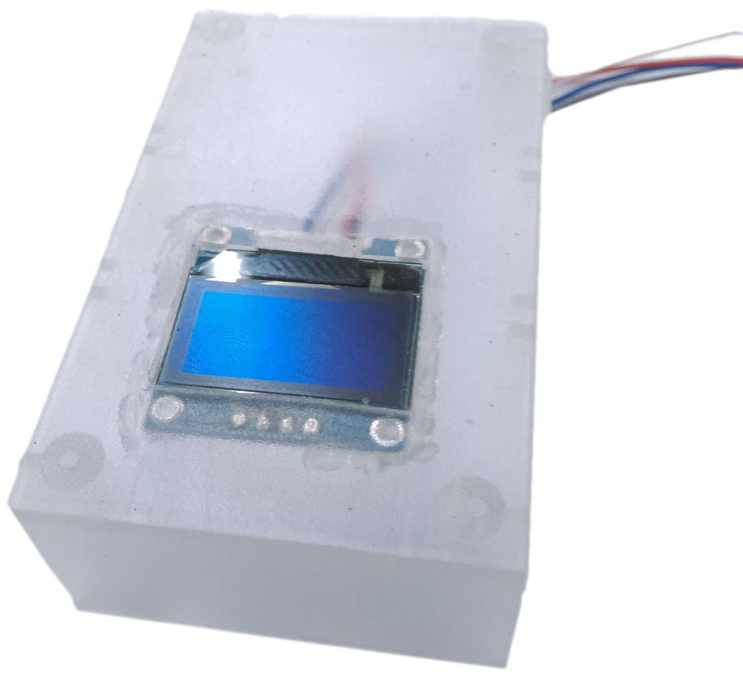
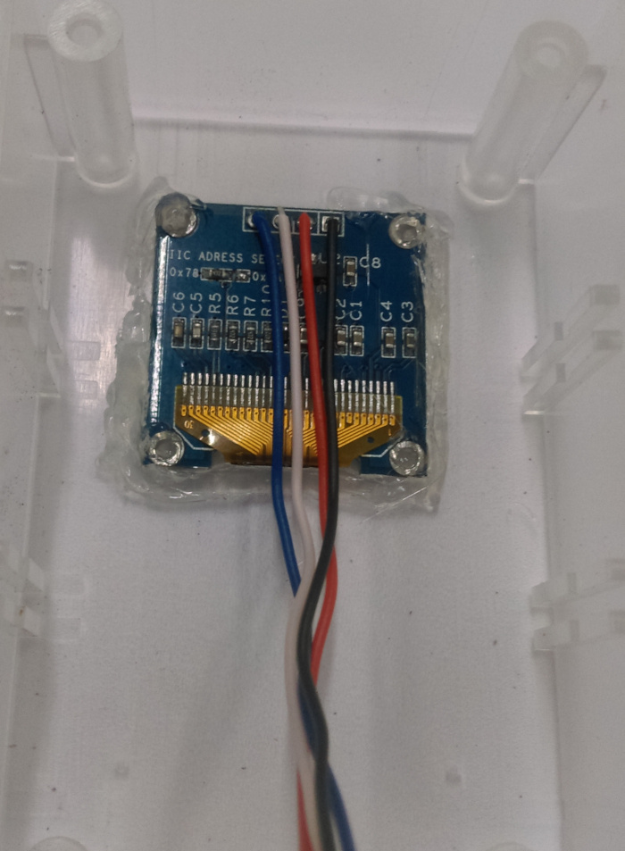
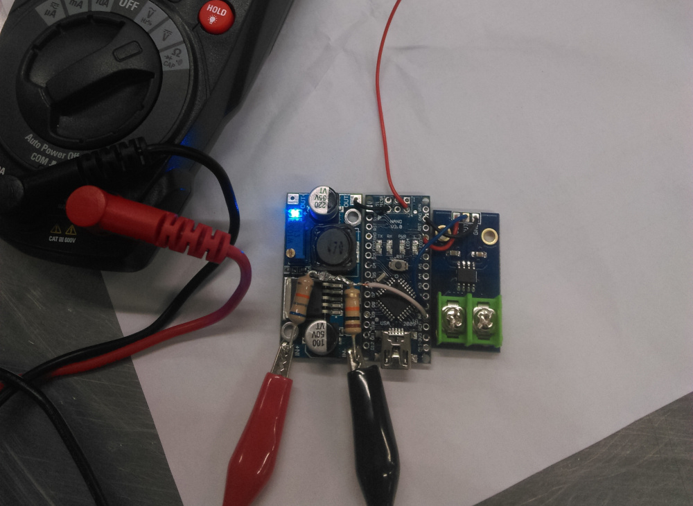
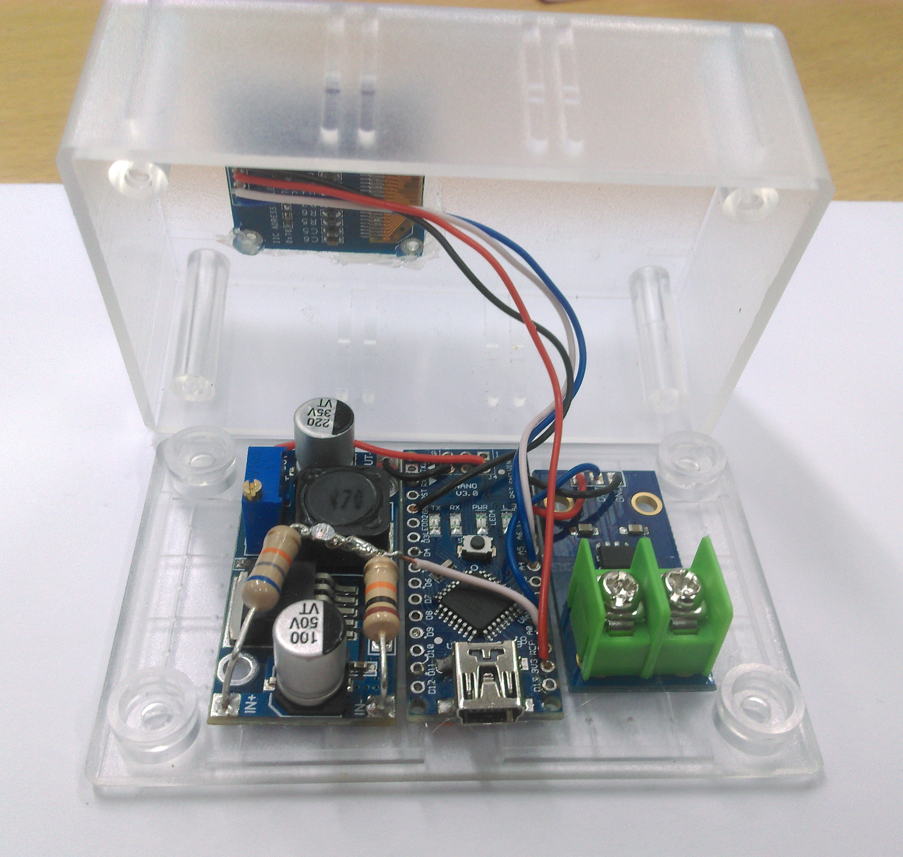
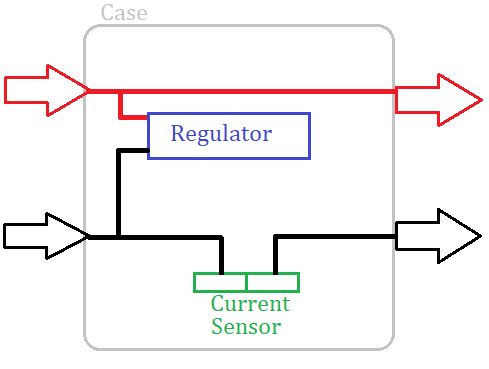
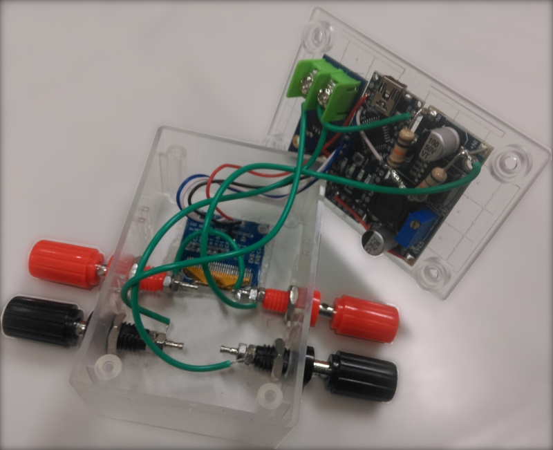

# DC Power Meter

Have a power source you need to measure the voltage of? Or want to see how much current you're putting through your projects? Have a go of our easy mini DC Power Meter project. Comes with Banana post screw terminals which will make it easier to connect anything to it, from any sorce.									
## Bill of Materials

| Qty | Code | Description |
| --- | --- | ------ |
|  1 | [XC4414](https://jaycar.com.au/p/XC4414) | Nano main board
|  1 | [XC4610](https://jaycar.com.au/p/XC4610) | Current sensor module
|  1 | [XC4514](https://jaycar.com.au/p/XC4514) | DC DC voltage regulator
|  1 | [HB6005](https://jaycar.com.au/p/HB6005) | Jiffy Box
|  1 | [XC4384](https://jaycar.com.au/p/XC4384) | OLED display
|  2 | [PT0454](https://jaycar.com.au/p/PT0454) | Black binding post
|  2 | [PT0453](https://jaycar.com.au/p/PT0453) | Red binding post
|  1 | [RR2798](https://jaycar.com.au/p/RR2798) | 10K Resistor
|  1 | [RR2818](https://jaycar.com.au/p/RR2818) | 68K Resistor
|  1 | [WH3032](https://jaycar.com.au/p/WH3032) | solid core wire

## Connection Tables 

**OLED Screen** 

| From | To Nano|
| --- | ---- |
| VCC | 3.3v | 
| GND |  GND |
| SDA |   A4 |  
| SCL |   A5 | 

**DC DC Regulator** 

Before wiring up the DC Regulator, be sure to adjust the potentiometer Counter clockwise to ensure that 5V is present on the output before you connect it to the NANO. 

We are also using a voltage divider across the input terminals to provide our VIN measurement, which is using the 68k and 10k resistor. This will connect to `A0` on the Nano and will reduce the voltage by 8 to be readable by the Arduino NANO (meaning a maximum of 40V possible to be measured)

**Current Sensor**

| From | To Nano |
| --- | --- | 
| VCC | 5V |
| GND | GND |
| OUT | A1 | 

## Prior reading
* [Removing headers](https://www.jaycar.com.au/removing-headers)

## Assembly instructions 

Firstly, remove all pins on the nano, screen, and current sensor. If you haven't, read the Removing headers article above.

We'll strip some of the WH3032 wire and solder them in place, then cut a hole 19mm x 27mm to mount the screen into the case.

We've used hot glue to hold in place.

Wrap two of the resistors together and solder together so they form a bond; then bend these to fit in the `IN` of the voltage regulator module, so that you can later solder a wire to the centre point where they join. Have a look at the pictures below if you're unsure.

 

Here we have done the meat of the connections, as there really isn't a lot to the project. Once all the pins have been removed, you can solder up the other connections using the solid core wire, making sure that the amount of wire is small so that they remain firm and tighly held together. 

**Important** You can notice that the red, 5V wire from the nano isn't connected yet. That is due to the fact that we must first ensure that the regulator is set to 5V through using a multimeter to measure the voltage on the output terminals, and adjusting it until it reaches 5v. Failure to do could quite easily burn out our arduino..

Once the sections are held together and the regulator is set to 5V, solder the OLED screen cables to the Nano and the nano to the regulator. Use some hot glue to mount the nano and sensors to the bottom secton of the jiffy box.

Now all you need to do is put on the input / output terminals, and solder them according to the schematic below.

We have connected ours like this, but you can place the terminals any way you like: 

## Programming

### Software Libraries needed

| Library | Author | Version |
| ---- | ---- | ---- | 
| Adafruit_GFX | Adafruit | any |
| Adafruit_SSD1306 | Adafruit | any | 

Simply install the libraries needed, load the code, and press upload. 

We have left the default font and a pretty minimal display; if you want greater sizes, use the `.setTextSize(int size)` and `.setCursor(int x, int y)` functions of the display object. The default font size is 8 pixels tall, so setting the size to 3 will make the text `3x8=24` pixels tall. Use that to help you position things correctly.

## Use

Connect the device to a voltage source 5V or higher, you should see the Voltage show up on the screen. Then connect a load ( such as lights ) to the other side of the unit, to see how much power is flowing through to the device that you are Powering. 

